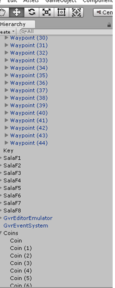

# Practica08-Laberinto-VR
Practica08 – Laberinto VR
OBJETIVO ALCANZADO:
- Experimenta con aplicaciones de realidad virtual.
- Experimenta con aplicaciones de realidad aumentada.
- Distingue la diferencia entre tecnologías de realidad virtual y realidad aumentada.
## ACTIVIDADES DESARROLLADAS
### Crear la GVR Camera Rig. Preparando la escena para la interacción


***

### Hacer que los objetos del juego sean interactivos. Programando el comportamiento de la moneda (coin)


#### Codigo de Coin.cs
```
using System.Collections;
using System.Collections.Generic;
using UnityEngine;
public class Key : MonoBehaviour {
    // TODO: Create variables to reference the game objects we need access to
    // Declare a GameObject named 'keyPoofPrefab' and assign the 'KeyPoof' prefab to the field in Unity
    // Declare a Door named 'door' and assign the top level 'Door' game object to the field in Unity
    public GameObject keyPoofPrefab;
    public Door door;
    void Update () {
        // OPTIONAL-CHALLENGE: Animate the key rotating
        // TIP: You could use a method from the Transform class
        transform.localRotation= Quaternion.Euler(270f, 90f, Mathf.Sin(Time.time) * 360f);
    }    
    public void OnKeyClicked (GameObject llave) {
		/// Called when the 'Key' game object is clicked
		/// - Unlocks the door (handled by the Door class)
		/// - Displays a poof effect (handled by the 'KeyPoof' prefab)
		/// - Plays an audio clip (handled by the 'KeyPoof' prefab)
		/// - Removes the key from the scene
    // Prints to the console when the method is called
		Debug.Log ("'Key.OnKeyClicked()' was called");               
        // TODO: Unlock the door, display the poof effect, and remove the key from the scene
        // Use 'door' to call the Door.Unlock() method
        door.Unlock();
        // Use Instantiate() to create a clone of the 'KeyPoof' prefab at this coin's position and with the 'KeyPoof' prefab's rotation
        Object.Instantiate(keyPoofPrefab, new Vector3(-18.667f, 2.584f, -8.581f), Quaternion.identity);
        keyPoofPrefab.transform.rotation = Quaternion.Euler(0f, Mathf.Sin(Time.time) * 360f, 0f);
        // Use Destroy() to delete the key after for example 0.5 seconds
        Object.Destroy(llave, 1.5f);
    }
}
```
***
### Hacer que los objetos del juego sean interactivos. Programando el comportamiento de la llave (key)


#### Codigo de Key.cs
```
using System.Collections;
using System.Collections.Generic;
using UnityEngine;
public class Key : MonoBehaviour {
    // TODO: Create variables to reference the game objects we need access to
    // Declare a GameObject named 'keyPoofPrefab' and assign the 'KeyPoof' prefab to the field in Unity
    // Declare a Door named 'door' and assign the top level 'Door' game object to the field in Unity
    public GameObject keyPoofPrefab;
    public Door door;
    void Update () {
        // OPTIONAL-CHALLENGE: Animate the key rotating
        // TIP: You could use a method from the Transform class
        transform.localRotation= Quaternion.Euler(270f, 90f, Mathf.Sin(Time.time) * 360f);
    }
    public void OnKeyClicked (GameObject llave) {
		/// Called when the 'Key' game object is clicked
		/// - Unlocks the door (handled by the Door class)
		/// - Displays a poof effect (handled by the 'KeyPoof' prefab)
		/// - Plays an audio clip (handled by the 'KeyPoof' prefab)
		/// - Removes the key from the scene
    // Prints to the console when the method is called
		Debug.Log ("'Key.OnKeyClicked()' was called");               
        // TODO: Unlock the door, display the poof effect, and remove the key from the scene
        // Use 'door' to call the Door.Unlock() method
        door.Unlock();
        // Use Instantiate() to create a clone of the 'KeyPoof' prefab at this coin's position and with the 'KeyPoof' prefab's rotation
        Object.Instantiate(keyPoofPrefab, new Vector3(-18.667f, 2.584f, -8.581f), Quaternion.identity);
        keyPoofPrefab.transform.rotation = Quaternion.Euler(0f, Mathf.Sin(Time.time) * 360f, 0f);
        // Use Destroy() to delete the key after for example 0.5 seconds
        Object.Destroy(llave, 1.5f);
    }
}
```
***
### Hacer que los objetos del juego sean interactivos. Programando el comportamiento de la puerta (door)


##### Codigo Door.cs
```
using System.Collections;
using System.Collections.Generic;
using UnityEngine;
public class Door : MonoBehaviour {    
    // TODO: Create variables to reference the game objects we need access to
    // Declare a GameObject named 'leftDoor' and assign the 'Left_Door' game object to the field in Unity
    // Declare a GameObject named 'rightDoor' and assign the 'Right_Door' game object to the field in Unity
    public GameObject leftDoor;
    public GameObject rightDoor;

    // TODO: Create variables to reference the components we need access to
    // Declare an AudioSource named 'audioSource' and get a reference to the audio source in Start()
    public AudioSource audioSource;
    public AudioSource cerrado;

    // TODO: Create variables to track the gameplay states
    // Declare a boolean named 'locked' to track if the door has been unlocked and initialize it to 'true'
    // Declare a boolean named 'opening' to track if the door is opening and initialize it to 'false'
    public bool locked = true;
    public bool opening = false;

    // TODO: Create variables to hold rotations used when animating the door opening
    // Declare a Quaternion named 'leftDoorStartRotation' to hold the start rotation of the 'Left_Door' game object
    // Declare a Quaternion named "leftDoorEndRotation" to hold the end rotation of the 'Left_Door' game object
    // Declare a Quaternion named 'rightDoorStartRotation' to hold the start rotation of the 'Right_Door' game object
    // Declare a Quaternion named 'rightDoorEndRotation' to hold the end rotation of the 'Right_Door' game object
    public Quaternion leftDoorStartRotation;
    public Quaternion leftDoorEndRotation;
    public Quaternion rightDoorStartRotation;
    public Quaternion rightDoorEndRotation;

    // TODO: Create variables to control the speed of the interpolation when animating the door opening
    // Declare a float named 'timer' to track the Quaternion.Slerp() interpolation and initialize it to for example '0f'
    // Declare a float named 'rotationTime' to set the Quaternion.Slerp() interpolation speed and initialize it to for example '10f'
    public float timer=0f;
    public float rotationTime=5f;    

    void Start () {        
        // TODO: Get a reference to the audio source
        // Use GetComponent<>() to get a reference to the AudioSource component and assign it to the 'audioSource'
        audioSource = GetComponent<AudioSource>();
        Debug.Log("pruebaAbierto");
        // TODO: Set start and end rotation values used when animating the door opening
        // Use 'leftDoor' to get the start rotation of the 'Left_Door' game object and assign it
        to 'leftDoorStartRotation'
        leftDoorStartRotation = Quaternion.Euler(270f, 0f, 90f);
        // Use 'leftDoorStartRotation' and Quaternion.Euler() to set the end rotation of the 'Left_Door' game object and assign it to 'leftDoorEndRotation'
        leftDoorEndRotation = leftDoorStartRotation * Quaternion.Euler(0f, 0f, -90f);
        // Use 'rightDoor' to get the start rotation of the 'Right_Door' game object and assign it to 'rightDoorStartRotation'
        rightDoorStartRotation = Quaternion.Euler(270f, 0f, 270f);
        // Use 'rightDoorStartRotation' and Quaternion.Euler() to set the end rotation of the 'Right_Door' game object and assign it to 'rightDoorEndRotation'
        rightDoorEndRotation = rightDoorStartRotation * Quaternion.Euler(0f, 0f, 90f);
    }
	void Update () {
        // TODO: If the door is opening, animate the 'Left_Door' and 'Right_Door' game objects rotating open
        // Use 'opening' to check if the door is opening...       
        if (opening)
        {            
            // ... use Quaternion.Slerp() to interpolate from 'leftDoorStartRotation' to 'leftDoorEndRotation' by the interpolation time 'timer / rotationTime' and assign it to the 'leftDoor' rotation
            leftDoor.transform.rotation = Quaternion.Slerp(leftDoorStartRotation, leftDoorEndRotation, timer / rotationTime);
            // ... use Quaternion.Slerp() to interpolate from 'rightDoorStartRotation' to 'rightDoorEndRotation' by the interpolation time 'timer / rotationTime' and assign it to the 'leftDoor' rotation
            rightDoor.transform.rotation = Quaternion.Slerp(rightDoorStartRotation, rightDoorEndRotation, timer / rotationTime);
            // ... use Time.deltaTime to increment 'timer'
            timer += Time.deltaTime;
        }
        
    }
    public void OnDoorClicked () {
		/// Called when the 'Left_Door' or 'Right_Door' game object is clicked
		/// - Starts opening the door if it has been unlocked
		/// - Plays an audio clip when the door starts opening
		// Prints to the console when the method is called
		Debug.Log ("'Door.OnDoorClicked()' was called");
        // TODO: If the door is unlocked, start animating the door rotating open and play a sound to indicate the door is opening
        // Use 'locked' to check if the door is locked and ...
        if (!locked)
        {
            // ... start the animation defined in Update() by changing the value of 'opening'
            opening = true;
            // ... use 'audioSource' to play the AudioClip assigned to the AudioSource component
            audioSource.Play();
        else
        {
            // OPTIONAL-CHALLENGE: Play a different sound if the door is locked
            // TIP: You could get a reference to the 'Door_Locked' audio and play it without assigning it to the AudioSource component
            cerrado.Play();
        }        
    }
	public void Unlock () {
		/// Called from Key.OnKeyClicked(), i.e. the Key.cs script, when the 'Key' game object is clicked
		/// - Unlocks the door

		// Prints to the console when the method is called
		Debug.Log ("'Door.Unlock()' was called");

        // TODO: Unlock the door 
        // Unlock the door by changing the value of 'locked'
        locked = false;
	}
}
```
***
### Hacer la interfaz de usuario interactiva. Programando el comportamiento del SignPost


#### Codigo SignPost.cs
```
using System.Collections;
using System.Collections.Generic;
using UnityEngine;
using UnityEngine.SceneManagement;
// TODO: Get convenient access the Scene and SceneManager classes
// Use the 'using' keyword to include the SceneManagement namespace
public class SignPost : MonoBehaviour {
	public void ResetScene () {
		/// Called when the 'SignPost' game object is clicked
		/// - Reloads the scene

		// Prints to the console when the method is called
		Debug.Log ("'SignPost.ResetScene()' was called");

        // TODO: Reset the scene by getting a reference to the scene and reloading it
        // Declare a Scene named 'scene', then use SceneManager.GetActiveScene () to get the current scene and assign it to 'scene'
        // Use SceneManager.LoadScene() and the Scene.name property to reload the scene
        SceneManager.LoadScene("Main");
    }
}
```
***
### Crear la funcionalidad del juego




***
### Conclusiones
El Proyecto de realización de un laberinto en Realidad virtual conlleva:
-	Diseño de la arquitectura
-	Planificación de movimiento dentro del laberinto
-	Planificación de Objetivo Primario y Secundarios dentro del mismo.
-	Modelado y conocimiento básico de Unity
-	Programación en C# de los diferentes comportamientos manejados por estos.
-	Tecnología que será utilizada para la utilización de la realidad virtual
Todos estos factores se agrupan para poder realizar el proyecto; esto genera muchas tareas y conceptos que deben ser manejados de manera sistemática.


